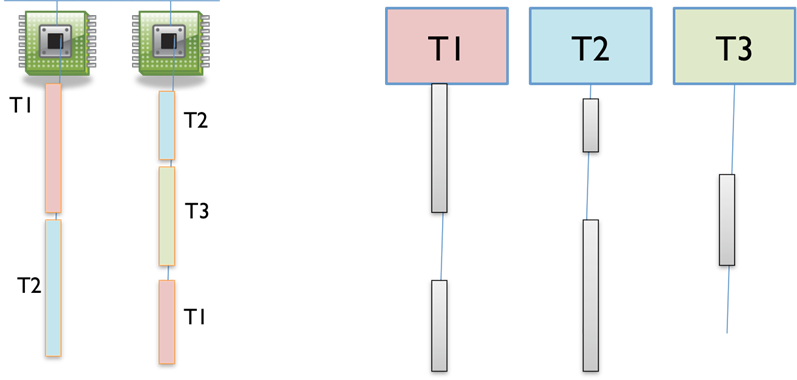
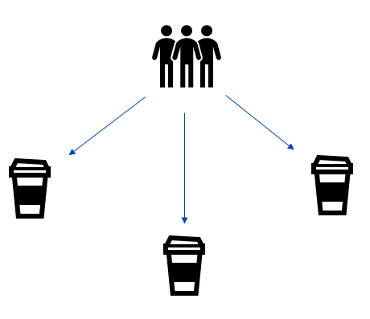
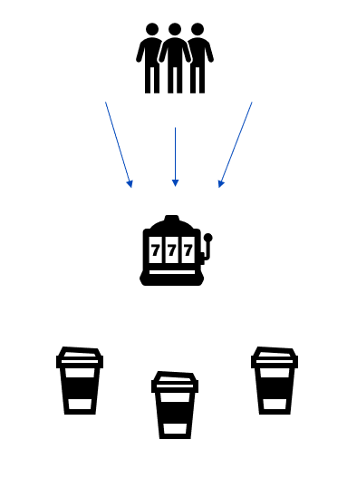
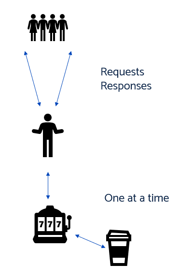

# Go Concurrency (WIP)

Warning - here be dragons. If you're new to programming this next section may blow your mind.

Concurrency means multiple computations are happening at the same time. Concurrency is everywhere in modern programming, whether we like it or not:​

- Multiple computers in a network​

- Multiple applications running on one computer​

- Multiple processors in a computer (today, often multiple processor cores on a single chip)​


In fact, concurrency is essential in modern programming:​

- Web sites must handle multiple simultaneous users.​

- Mobile apps need to do some of their processing on servers (“in the cloud”).​

- Graphical user interfaces almost always require background work that does not interrupt the user. For example, Eclipse compiles your Java code while you’re still editing it.

---

## Time Slicing

How can I have many concurrent threads with only one or two processors in my computer? When there are more threads than processors, concurrency is simulated by *time slicing*, which means that the processor switches between threads. ​



The figure above shows how three threads T1, T2, and T3 might be time-sliced on a machine that has only two actual processors. In the figure, time proceeds downward, so at first one processor is running thread T1 and the other is running thread T2, and then the second processor switches to run thread T3. Thread T2 simply pauses, until its next time slice on the same processor or another processor.​

On most systems, time slicing happens unpredictably and non-deterministically, meaning that a thread may be paused or resumed at any time.​

## Links

https://www.youtube.com/watch?v=olYdb0DdGtM
https://www.youtube.com/watch?v=cdPZ1pJACMI
https://web.mit.edu/6.005/www/fa14/classes/17-concurrency/
https://www.toptal.com/software/introduction-to-concurrent-programming
https://medium.com/swlh/go-a-tale-of-concurrency-a-beginners-guide-b8976b26feb

---

## Concurrency in Go

Okay, so if you've got this far we're now getting into some of the very cool and confusing things Go does - concurrency.

When we mention concurrency people tend to think of "running things in parallel", but as Rob Pike points out they are very different in the video below.

Concurrency is about *managing multiple tasks or processes and their interactions effectively*, while parallelism involves actually *executing these tasks simultaneously to improve performance*. Concurrency is often a design consideration, while parallelism is a means of optimizing execution

[Video](https://www.youtube.com/watch?v=oV9rvDllKEg)

## Goroutines

A goroutine is similar to a thread, but it is scheduled by Go, not the OS. Code that runs in a goroutine can run concurrently with other code. Let's look at an example.


There are a few interesting things going on here, but the most important is how we start a goroutine. We simply use the go keyword followed by the function we want to execute. If we just want to run a bit of code, such as the above, we can use an anonymous function. Do note that anonymous functions aren't only used with goroutines, however.

Goroutines are easy to create and have little overhead. Multiple goroutines will end up running on the same underlying OS thread. This is often called an M:N threading model because we have M application threads (goroutines) running on N OS threads. The result is that a goroutine has a fraction of overhead (a few KB) than OS threads. On modern hardware, it's possible to have millions of goroutines.

Furthermore, the complexity of mapping and scheduling is hidden. We just say this code should run concurrently and let Go worry about making it happen.
If we go back to our example, you'll notice that we had to Sleep for a few milliseconds. That's because the main process exits before the goroutine gets a chance to execute (the process doesn't wait until all goroutines are finished before exiting). To solve this, we need to coordinate our code.

### Goroutines Lab

* Ordering experiment
  * Create 10 goroutines. Make each one print a single, different word. Run all 10. Do this a few times
  * What do you notice about the order?

---

## Channels

The challenge with concurrent programming stems from sharing data. If your goroutines share no data, you needn't worry about synchronizing them. That isn't an option for all systems, however. In fact, many systems are built with the exact opposite goal in mind: to share data across multiple requests. An in-memory cache or a database, are good examples of this. This is becoming an increasingly common reality.

Channels help make concurrent programming saner by taking shared data out of the picture. A *channel* is a communication pipe between *goroutines* which is used to pass  *data* . In other words, a goroutine that has data can pass it to another goroutine via a channel. The result is that, at any point in time, only one goroutine has access to the data.

The final thing to know before we move on is that receiving and sending to and from a channel is **blocking**. That is, when we receive from a channel, execution of the goroutine won't continue until data is available. Similarly, when we send to a channel, execution won't continue until the data is received.


---

Creating goroutines is trivial, and they are so cheap that we can start many; however, concurrent code needs to be coordinated. To help with this problem, Go provides channels. Before we look at channels, I think it's important to understand a little bit about the basics of concurrent programming.

Writing concurrent code requires that you pay specific attention to where and how you read and write values. In some ways, it's like programming without a garbage collector -- it requires that you think about your data from a new angle, always watchful for possible danger.

### Channel Example

[Go Playground Link](https://goplay.tools/snippet/k7nuzRlPg9W)

```go
jobs := make(chan int, 5)
results := make(chan int, 5)
```

Here, we're creating two channels, `jobs` and `results`, both capable of holding up to 5 integer values in their buffers. These channels will be used for communication between the `main` goroutine and the `worker` goroutines.


> That's right, `main` is actually a goroutine itself!

```go
    for w := 1; w <= 3; w++ {
        go worker(w, jobs, results)
    }
```

 Inside each iteration of the for loop, a new goroutine is launched to execute the `worker` function. The `worker` function is called with three arguments: the loop variable `w`, the `jobs` channel, and the `results` channel. 

 ```go
    for j := 1; j <= 5; j++ {
        jobs <- j
    }
    close(jobs)
 ```

Inside each iteration of the for loop, the value of `j` is sent into the `jobs` channel using the send operator `<-`. This means that each integer from 1 to 5 is *sent as a job to be processed by the worker goroutines*.

After all jobs have been sent, the `close` function is called on the `jobs` channel. This indicates that *no more values* will be sent on the channel. It's a signal to the `worker` goroutines that they should stop waiting for new jobs AFTER they have finished processing the current ones.

```go
    for a := 1; a <= 5; a++ {
        fmt.Println("Result:", <-results)
    }
```

The `<-` operator is used to receive a value from the `results` channel. This operation **blocks** until a value is available on the channel. Once a value is received, it is printed.

 Now, when you run this code you get an output like:

 ```
 Worker 3 processing job 1
Worker 1 processing job 2
Worker 2 processing job 3
Worker 3 processing job 5
Result: 4
Result: 2
Result: 6
Worker 1 processing job 4
Result: 8
Result: 10
 ```

 >NOTE: Your output is likely to be different every time you run it!

### Channels lab

* Create a goroutine that sends the integers 1 to 10 over a channel. Create another go routine that reads them off and prints them out​

---

### Worker pool experiment​

* Modify Channel Experiment. Make three ‘worker’ goroutines read numbers of the channel and print​

* Run this a few times. Is the order consistent? When might this matter? When might it not matter?

---

## The Actor Model

## What is concurrency?

1. "Doing work in parallel"
2. Imagine a Starbucks
    - Three baristas
    - different coffee each
Get three times as many coffees out



### Sounds simple...

But imagine there's only *one* machine. So now we have:

- all 3 using the same machine
- at the same time

Everything gets mixed up!



Oh dear. We have just invented the
Choca
Wocka
Mocha
Tea
Orange
BananaSplit with frothy milk

### Broken Example

Concurrency fails when we:

1. Mutate shared state
2. Shared across goroutines

Let's take a look at some code:

[Go Playground Link](https://goplay.tools/snippet/IlLDVFZnzhk)

```go
// Protected Data resource - not concurrent safe
var coffeeOrder = []byte("               ")

func main() {

	go writeText("Choca          ")
	go writeText("Mocha with Milk")
	go writeText("Banana Shake   ")
	go writeText("Tea no sugar   ")

	// What on earth will be in coffeeOrder now?
	time.Sleep(1 * time.Second)

	fmt.Println(string(coffeeOrder))
}

func writeText(newOrder string) {

	// CRITICAL SECTION STARTS
	orderAsBytes := []byte(newOrder)
	for index, b := range orderAsBytes {
		coffeeOrder[index] = b
		time.Sleep(10 * time.Millisecond)
	}
	// CRITICAL SECTION ENDS
}
```

In our logical ordered brains, these lines:

```go
    go writeText("Choca          ")
	go writeText("Mocha with Milk")
	go writeText("Banana Shake   ")
	go writeText("Tea no sugar   ")
```

..should execute in order. The first one will work on Choca and then move on to the second one, right? 

Run it a few times. The data you get will be corrupted and unpredictable, like:


This is what we mean about concurrency in general - it can be very hard to understand and ensure things like this don't happen due to the nature of time slicing and multiple cores and threads on a PC.

### Mutexes (or Locks)

Mutexes are a way to ensure the function works syncronously - that is, it doesn't let anythign else in until it's finished with what it has. We often use the example of a toilet:


Wait your turn!

If unlocked
- Enter the ‘protected area’
- Lock the door
- Do the thing
- Unlock the door
- Leave

If locked
- Wait your turn until it is unlocked

#### Mutexes in code

[Go Playground with mutexes](https://goplay.tools/snippet/NT7Gp8HMFOw)

```go
var coffeeOrder = []byte("               ")
var mutex sync.Mutex //new import of "sync" package

func main() {

	//same as before
}

func writeText(newOrder string) {
	// WAIT until the lock is free
	mutex.Lock()

	// DON'T FORGET to unlock the lock at the end!
	defer mutex.Unlock()

	// CRITICAL SECTION STARTS
	orderAsBytes := []byte(newOrder)
	for index, b := range orderAsBytes {
		coffeeOrder[index] = b
		time.Sleep(10 * time.Millisecond)
	}
	// CRITICAL SECTION ENDS
}
```

We have only added a couple of things:

`mutex.Lock()`
- Wait in line to be unlocked
- Lock

Run ‘Critical Section’ Code
- The code that needs making safe

`mutex.Unlock()`
- Open the lock for others

### Without using Mutexes

It's the idiomatic Go solution using Goroutines and Channels rather than using Mutexes!

> “Don’t communicate by sharing – share by communicating”

#### What doe the Actor Model do?

Encapsulates concurrency management

- Requests are asynchronous
- Requests placed on a channel
- Single goroutine reads requests from channel
- Handles requests one at a time

Many goroutines can add a request to the channel

The Actor *guarantees* only one will access the protected resource

